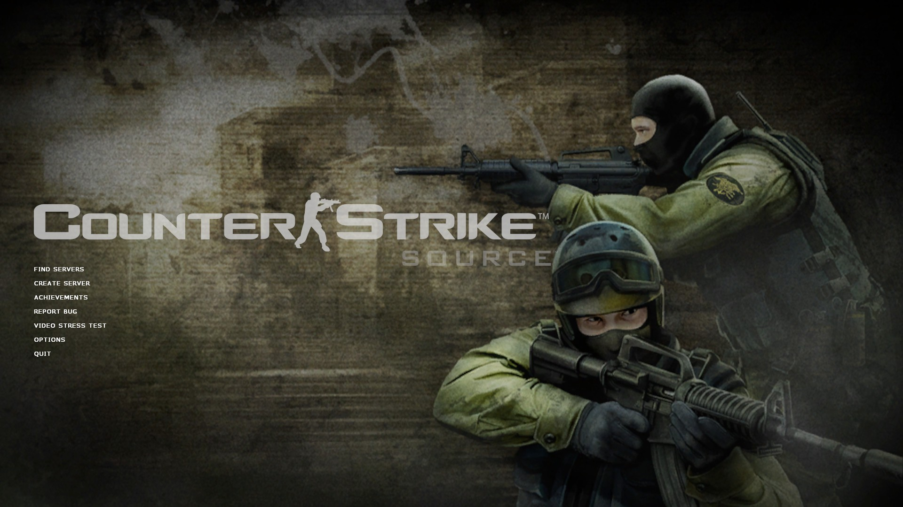
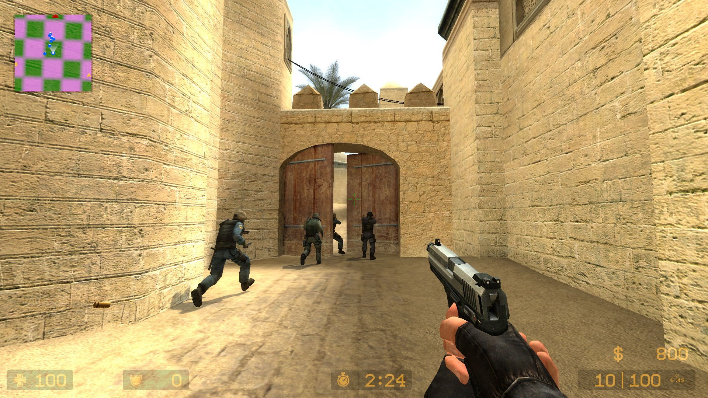
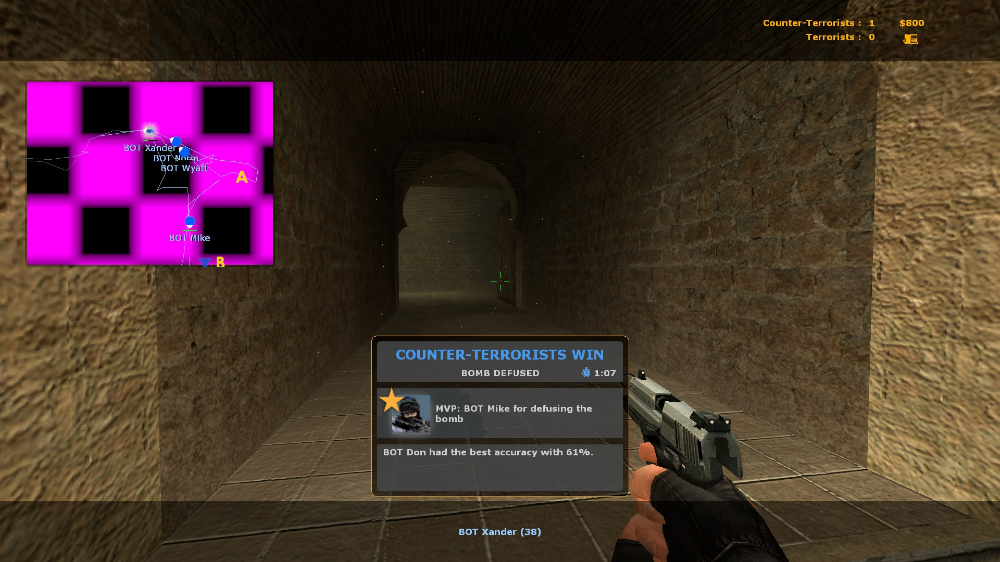
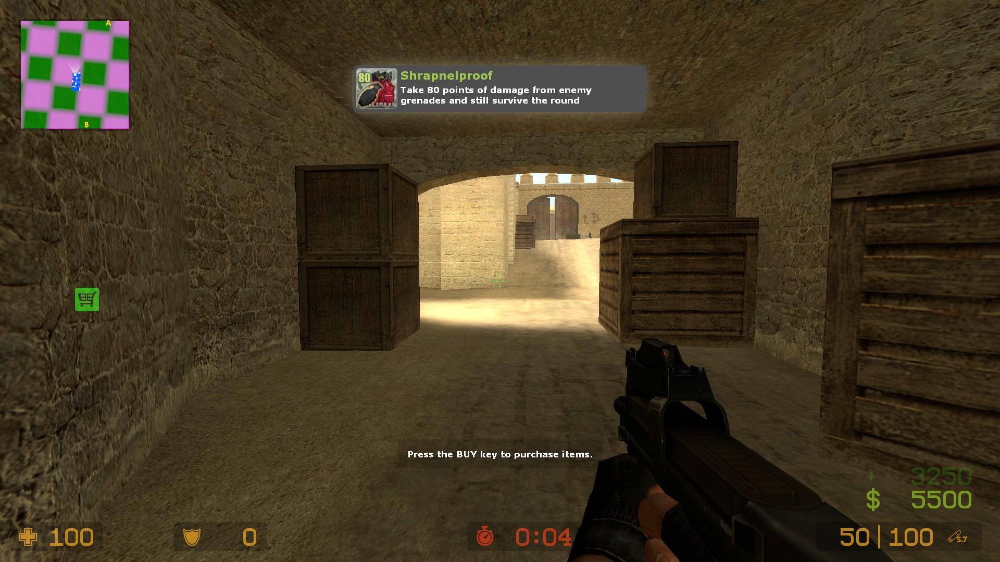

# Counter-Strike: Source – Source SDK 2013 Port (WIP)

This is an ongoing effort to port **Counter-Strike: Source** to the **2013 Source SDK (Multiplayer branch, old version)**. The project is currently **playable**, but comes with **many bugs and rough edges**.

We hope this serves as a base for a community cleanup and polish effort. 

There are also plans to port this to the newer 2013 SDK, but no playable builds yet.

---

## ⚠️ Disclaimer

This project is **incomplete and experimental**. Some features may not work correctly, and setup requires manual intervention and problem-solving.

---

## 🔧 Building the Project (Windows Only)

> Linux build support is untested. Contributions to help with that are welcome!

1. Run `createcstrikeprojects.bat` located in `\mp\src\`
2. Open the generated solution in **Visual Studio 2022**
3. **Clean** the solution
4. **Build** the solution in `Release` mode
5. Output will be placed in:  
   `\mp\game\mod_cstrike\`
6. Copy the `mod_cstrike` folder to your **Source SDK Base 2013 Multiplayer** `sourcemods` directory

---

## ⚙️ Game Setup Caveats

Before launching the mod, be aware of the following:

- You need Counter-Strike: Source content:
  - I couldn’t get the proper mounting from the old CSS branch to work.
  - Instead, I manually copied CSS content files into `custom/`.
  - I also commented out the CSS mount paths in `gameinfo.txt` to prevent errors.

- You'll also need the **GUI files** from Counter-Strike: Source to prevent crashes or missing UI elements.

- The game will not run under the new SDK, when you have SDK 2013 MP installed, you'll need it set to `previous2021`. Stay tuned for a possible fix for this soon.

- **Bots are supported**:
  - A `botprofile.db` file is included under the `/custom/` folder of this repository.
  - This is for testing and may be improved or moved later.
  
- **Bot Radio Chatter** causes **crashes** — set it to **Off** in the audio settings.

---

## 📌 Known Issues

- CSS content mounting doesn't work out of the box
- Various graphical and gameplay bugs
- Crashes with bot audio chatter
- Missing or broken UI elements without proper GUI files

---

## 🛠️ Future Plans

- Clean up code and assets
- Improve content mounting process
- Support Linux
- Port to **Source SDK 2013 (new branch)** for better toolchain and compatibility

---

## 💬 Want to Help?

If you're a developer, tester, or just a fan of Source engine modding — **contributions are welcome!**

Please submit PRs, open issues, or start discussions to help push the project forward.

---

## 📁 Folder Notes

- `custom/` — Contains test content like bot profiles and CSS files (you may need to add more manually)
- `mod_cstrike/` — The output game folder to be copied into `sourcemods`

---

## 📷 Screenshots

---

## 📜 License

copyright lololololololololol

---

Thanks for checking out the project! Let’s make this into something great together.

---

# cstrike-sdk-2013
Counter-Strike Source (partially) ported to the 2013 Source (old) SDK

Github won't let me clone the parent repo so I am uploading it this way.

Original:

https://github.com/GEEKiDoS/cstrike-sdk-2013/

               SOURCE 1 SDK LICENSE

Source SDK Copyright(c) Valve Corp.  

THIS DOCUMENT DESCRIBES A CONTRACT BETWEEN YOU AND VALVE 
CORPORATION ("Valve").  PLEASE READ IT BEFORE DOWNLOADING OR USING 
THE SOURCE ENGINE SDK ("SDK"). BY DOWNLOADING AND/OR USING THE 
SOURCE ENGINE SDK YOU ACCEPT THIS LICENSE. IF YOU DO NOT AGREE TO 
THE TERMS OF THIS LICENSE PLEASE DON’T DOWNLOAD OR USE THE SDK.  

  You may, free of charge, download and use the SDK to develop a modified Valve game 
running on the Source engine.  You may distribute your modified Valve game in source and 
object code form, but only for free. Terms of use for Valve games are found in the Steam 
Subscriber Agreement located here: http://store.steampowered.com/subscriber_agreement/ 

  You may copy, modify, and distribute the SDK and any modifications you make to the 
SDK in source and object code form, but only for free.  Any distribution of this SDK must 
include this LICENSE file and thirdpartylegalnotices.txt.  
 
  Any distribution of the SDK or a substantial portion of the SDK must include the above 
copyright notice and the following: 

    DISCLAIMER OF WARRANTIES.  THE SOURCE SDK AND ANY 
    OTHER MATERIAL DOWNLOADED BY LICENSEE IS PROVIDED 
    "AS IS".  VALVE AND ITS SUPPLIERS DISCLAIM ALL 
    WARRANTIES WITH RESPECT TO THE SDK, EITHER EXPRESS 
    OR IMPLIED, INCLUDING, BUT NOT LIMITED TO, IMPLIED 
    WARRANTIES OF MERCHANTABILITY, NON-INFRINGEMENT, 
    TITLE AND FITNESS FOR A PARTICULAR PURPOSE.  

    LIMITATION OF LIABILITY.  IN NO EVENT SHALL VALVE OR 
    ITS SUPPLIERS BE LIABLE FOR ANY SPECIAL, INCIDENTAL, 
    INDIRECT, OR CONSEQUENTIAL DAMAGES WHATSOEVER 
    (INCLUDING, WITHOUT LIMITATION, DAMAGES FOR LOSS OF 
    BUSINESS PROFITS, BUSINESS INTERRUPTION, LOSS OF 
    BUSINESS INFORMATION, OR ANY OTHER PECUNIARY LOSS) 
    ARISING OUT OF THE USE OF OR INABILITY TO USE THE 
    ENGINE AND/OR THE SDK, EVEN IF VALVE HAS BEEN 
    ADVISED OF THE POSSIBILITY OF SUCH DAMAGES.  
 
       
If you would like to use the SDK for a commercial purpose, please contact Valve at 
sourceengine@valvesoftware.com.
